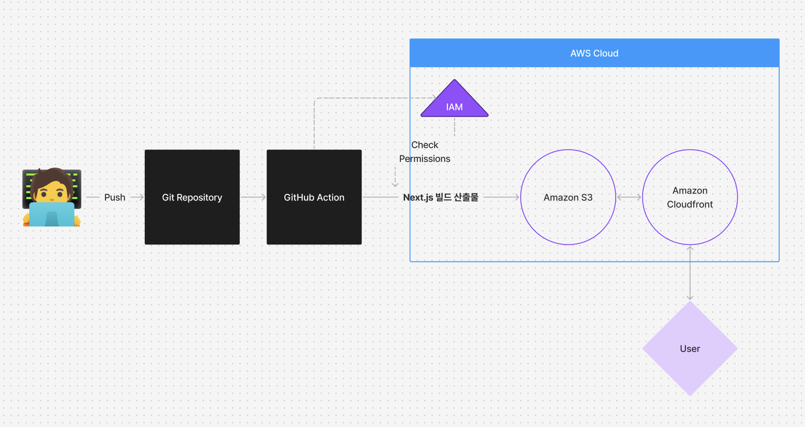
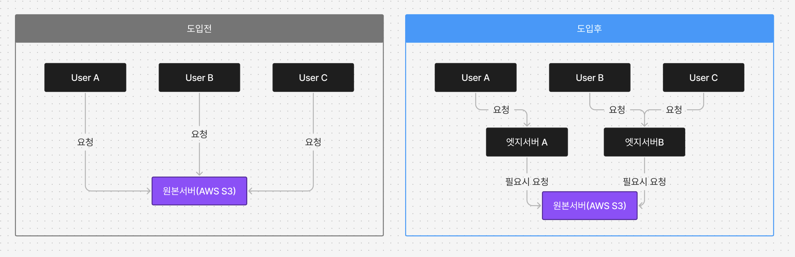

# 프론트엔드 배포 파이프라인

## 개요


GitHub Actions에 작성된 워크플로우는 다음과 같이 배포가 진행되도록 합니다.

1. 저장소를 체크아웃합니다.
2. Node.js 18.x 버전을 설정합니다.
3. 프로젝트 의존성을 설치합니다.
4. Next.js 프로젝트를 빌드합니다.
5. AWS 자격 증명을 구성합니다.
6. 빌드된 파일을 S3 버킷에 동기화합니다.
7. CloudFront 캐시를 무효화합니다.
ㅈ
```bash
npm run dev
# or
yarn dev
# or
pnpm dev
# or
bun dev
```


## 주요 링크

- S3 버킷 웹사이트 엔드포인트: http://yujinawsbucket.s3-website.us-east-2.amazonaws.com
- CloudFrount 배포 도메인 이름: https://dryk6smjb2f9w.cloudfront.net


## 주요 개념

- GitHub Actions과 CI/CD 도구: 
    - 코드 변경사항이 main 브랜치에 push될 때 자동으로 빌드/배포 실행
    - npm build, AWS 인증, S3 업로드 등의 작업을 자동화
    - deployment.yml 파일로 배포 워크플로우 정의
- S3와 스토리지: 
    - 정적 웹사이트 호스팅 기능 사용
    - 빌드된 프론트엔드 파일들(HTML, CSS, JS 등) 저장
    - 버킷 정책으로 public 접근 설정 필요
- CloudFront와 CDN: 
    - S3의 콘텐츠를 전세계 엣지 로케이션에 캐싱
    - HTTPS 제공 및 트래픽 가속화
    - 사용자와 가까운 서버에서 콘텐츠 제공
- 캐시 무효화(Cache Invalidation): 
    - 새 배포 시 이전 캐시 삭제 필요
    - CloudFront 배포 ID와 파일 경로로 무효화
    - GitHub Actions에서 AWS CLI로 자동화 가능
- Repository secret과 환경변수: 
    - AWS 접근키(Access Key/Secret Access Key) 저장
    - GitHub Settings > Secrets에서 설정
    - 워크플로우에서 ${{ secrets.S3_BUCKET_NAME }} 형태로 사용


## CDN과 성능최적화

### CDN 도입 전과 도입 후의 성능 개선 보고서

1. 도입배경
해당 웹사이트 성능 최적화를 위해 CDN을 도입하게 되었습니다. 

CDN은 지리적으로 분산된 서버 네트워크를 통해 콘텐츠를 사용자와 가까운 위치에서 전송하는 서비스입니다. 주요 콘텐츠를 여러 지역의 엣지 서버에 캐싱하여, 원본 서버와의 거리에 관계없이 빠른 속도로 콘텐츠를 제공할 수 있습니다.
따라서 다음과 같은 결과를 위해 Amazon Cloudfront을 도입하였습니다.

- 성능 향상: 사용자와 가까운 서버에서 콘텐츠 전송
- 서버 부하 감소: 원본 서버의 부하를 분산
- 가용성 향상: 트래픽 폭주 시에도 안정적인 서비스 제공
- 비용 절감: 대역폭 사용량 최적화

2. 도입전후 비교 분석

2-1. 시스템구조 변화



2-2. 성능비교

| 지표                           | CDN 도입 전 | CDN 도입 후 | 개선율         |
|--------------------------------|-------------|-------------|----------------|
| First Contentful Paint (FCP)   | 0.7 초      | 0.4 초      | 42.86% ↓    |
| Largest Contentful Paint (LCP) | 0.8 초      | 0.5 초      | 37.5% ↓     |
| Total Blocking Time (TBT)      | 0 밀리초    | 0 밀리초    | 동일         |
| Cumulative Layout Shift (CLS)  | 0       | 0           | 동일 |
| Speed Index                    | 0.9 초      | 0.4 초      | 55.56% ↓    |


3. 결론
CDN 도입을 통해 다음과 같은 주요 성과를 달성했습니다
- 첫 페이지 로딩 시간 42.86% 개션
- 마지막 페이지 로딩 시간 37.5% 개선
- Speed Index 55.56% 개선